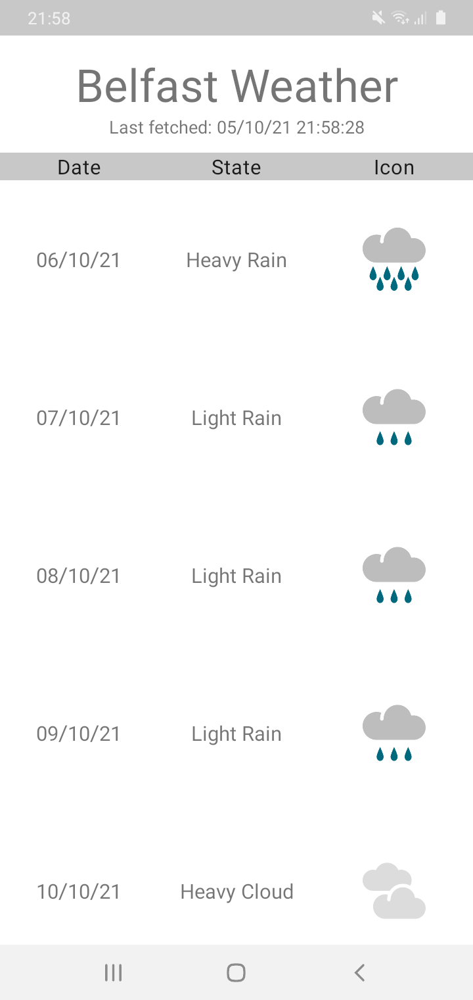

# Belfast Weather App
Fetch the next 5 days weather forecast using https://www.metaweather.com/api 

75% Java - View, ViewModel, Adapter, Repo

25% Kotlin - Model, Dao, Api

Using both RetroFit and Volley to show 2 different networking approaches

Using Glide for image loading

 

